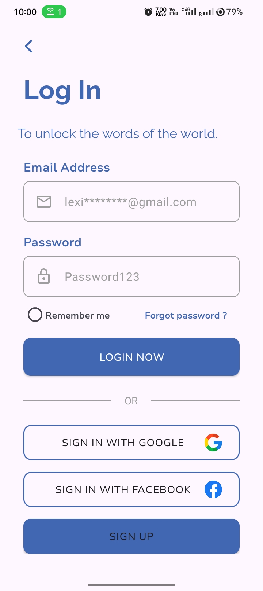
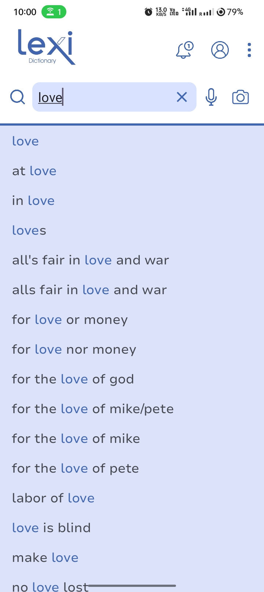

# Lexi - Online Dictionary App

Lexi is an innovative Android online dictionary application designed to provide quick, accurate, and user-friendly access to word definitions. The app is being developed with modern Android technologies and aims to enhance the user experience with features such as voice search, image search, and offline support.

## Features
### Completed Features:
- **Online word search**: Users can search for word definitions using the app's intuitive UI.
- **MVVM Architecture**: The app follows the MVVM (Model-View-ViewModel) architecture pattern for better separation of concerns and maintainability.
- **Retrofit Integration**: Retrofit is used for making API calls to fetch word data.
- **Clean UI Design**: A user-friendly interface designed with XML layouts.

### Planned Features:
- **Firebase Authentication**: User authentication using Firebase to enable personalized experiences.
- **Voice Search**: Allow users to search for words using voice commands.
- **Image Search**: Enable users to search for words by capturing images.
- **Offline Mode with Room Database**: Provide offline word search capability by storing word data locally using Room.

## Screenshots
<div style="display: flex; justify-content: space-around;">
    
    
    
</div>

## Technologies Used
- **Programming Language**: Kotlin
- **UI Design**: XML
- **Networking**: Retrofit
- **Architecture**: MVVM (Model-View-ViewModel)

## Installation
1. Clone the repository:
   ```bash
   git clone https://github.com/MyoWin-andrDev/Lexi-Dictionary.git
   ```
2. Open the project in Android Studio.
3. Build and run the project on an Android emulator or physical device.

## Contributions
Contributions are welcome! If you would like to contribute to this project, feel free to fork the repository and submit a pull request.

## License
This project is licensed under the MIT License. See the [LICENSE](LICENSE) file for more details.

## Contact
If you have any questions or suggestions, please contact [Myo Win (Phyo Hein)](https://github.com/MyoWin-andrDev).

---

Stay tuned for more updates as the development of Lexi continues!

